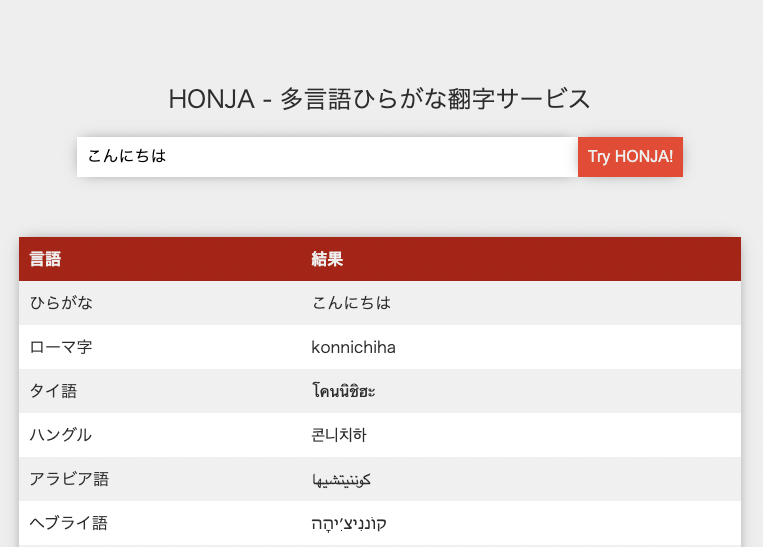

# HONJA 多言語翻字ツール




`こんにちは` を韓国語に変換すると `콘니치하` タイ語に変換すると `โคนนิชิฮะ` 

これらは`こんにちは`と発音します。このような音だけを残す文字変換を翻字といいます。

HONJAは多言語でひらがなを翻字できるツールです。

## [DEMOサイト](https://yoshikai.net/honja)

### 動作環境
* Node.js
* npm

### 使い方
| サポートしている言語 |
| ---- |
| Thai |
| Russian |
| Arabic |
| Korean |
| Hindi |
| Tibetan |
| Hebrew |
| Khmer |
| Amharic |
| Tamil |
| Armenian |
| Burmese |
| Greek |
| Georgian |
| Sinhalese |
| Romaji |

**インストール**
```bash
npm install -g honja
```

**翻字**

ひらがなとカタカナのみをサポートしています。
```bash
honja Korean "ぼくのなまえはたくとです"
honja Greek "ぼくのなまえはたくとです"
honja Romaji "ぼくのなまえはたくとです"

# まとめて変換
honja All "ぼくのなまえはたくとです"
```

出力
```javascript
{
  Thai: 'โบคุโนนามาเอวาตาคุโตเดซุ',
  Russian: 'бокунонамаэватакутодэсу',
  Arabic: 'بوكونوناماإيواتاكوتوديسو',
  Korean: '보쿠노나마에와타쿠토데스',
  Hindi: 'बोकुनोनामाएवाताकुतोदेसु',
  Tibetan: 'རྦོ་ཁུ་ནོ་ན་མ་ཨེ་ཝ་ཐ་ཁུ་ཐོ་རྡེ་སུ་',
  Hebrew: 'בּוֹקוּנוֹנָמָאֵווָטָקוּטוֹדֵסוּ',
  Khmer: 'បុកឹណុណាមាអិវាតាកឹតុដិសឹ',
  Amharic: 'ቦኩኖናማኤዋታኩቶዴሡ',
  Tamil: 'போகூநோநாமாஏவாதாகூதோதேஸூ',
  Armenian: 'բոքունոնամաեուաթաքութոդեսու',
  Burmese: 'ဘိုကူနိုနာမာအဲဝါတာကူတိုဒဲဆူ',
  Greek: 'μποκουνοναμαεβατακουτοντεσου',
  Georgian: 'ბოკუნონამაეუატაკუტოდესუ',
  Sinhalese: 'බෝකූනෝනමඒවටකූටෝඩේසූ',
  Romaji: 'bokunonamaewatakutodesu',
  Hiragana: 'ぼくのなまえわたくとです'
}
```

### JavaScript API

```javascript
const Honja = require("honja");
const honja = new Transliterator();

let result;
result = honja.convert("こんにちは", "Korean");

//サポートされている全ての言語に変換
result = honja.convertAll("こんにちは");
```

### 開発者
- 吉開 拓人
- 吉開 章


### Contributing

Contributions are what make the open source community such an amazing place to learn, inspire, and create. Any contributions you make are greatly appreciated.

If you have a suggestion that would make this better, please fork the repo and create a pull request. You can also simply open an issue with the tag "enhancement". Don't forget to give the project a star! Thanks again!

1. Fork the Project
2. Create your Feature Branch (git checkout -b feature/AmazingFeature)
3. Commit your Changes (git commit -m 'Add some AmazingFeature')
4. Push to the Branch (git push origin feature/AmazingFeature)
5. Open a Pull Request

### License
MIT License
